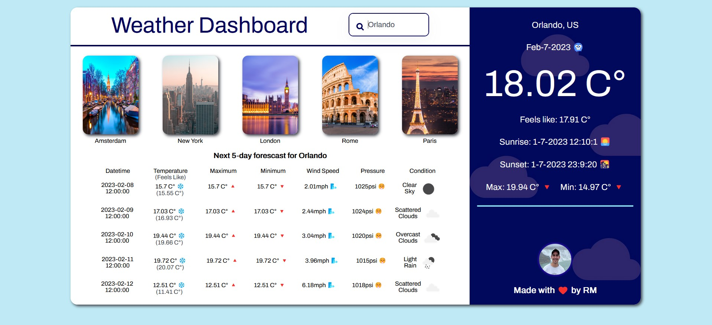
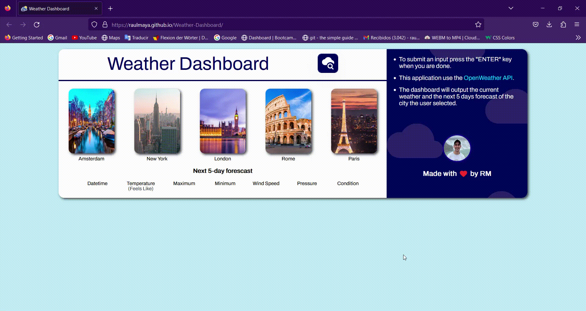

<!-- PROJECT LOGO -->
 

  

  <h2 align="center">Weather Dashboard</h2>
  <h4 align="center">Server Side APIs & JavaScript Project</h4>

  

  This project consists in a building a weather dashboard using server side APIs to populate the information in the application, it also uses JavaScript and CSS to provide a polish user interface and user experience.
     
     
    <a href="https://github.com/RaulMaya/Weather-Dashboard">Repository</a>    
    ·
    <a href="https://raulmaya.github.io/Football-Quiz/">Deployment</a>
    ·
    <a href="https://www.linkedin.com/in/raul-maya/">My LinkedIn</a>

  

<!-- ABOUT THE PROJECT -->

### About The Project

 

This project was created using tools such as JavaScript, Server-Side APIs <a href="https://openweathermap.org/">Open Weather API</a> and Browser tools. The main menu of the dashboard will display some important and big cities around the world so you can try them as possible options to display the weather. Also, the user can open the search box at the right of the dashboard title, so it can type whatever city the user wants to look at.

At the bottom of the dashboard, it will be displayed a 5 days weather forecast for the city the user selected or input. Also, at the right of the dashboard it will be displayed the current weather and additional information of the selected city.

The dashboard has error handlers and user proof mistakes so it can handle them in a smooth way, to improve user experience, for instance if the user leaves a blank in the input form and submit it, the application will return with a friendly message, explaining which was the problem, this will trigger also if the user types a nonexistent city

### Contact :iphone:

- Name: Raul Maya Salazar
- Phone: +52 833 159 7006
- E-mail: raulmayas20@gmail.com
- GitHub: https://github.com/RaulMaya
- LinkedIn: https://www.linkedin.com/in/raul-maya/

(<a href="#top">back to top</a>)

